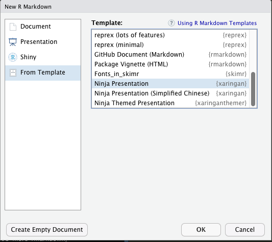

# xaringan

### /ʃaː.'riŋ.ɡan/

.pull-left[
```{r, echo=FALSE, out.width="70%", fig.align='center'}
knitr::include_graphics("https://upload.wikimedia.org/wikipedia/commons/b/be/Sharingan_triple.svg")
```

]
.pull-right[
```{r echo=FALSE, out.width="70%", fig.align='center'}
knitr::include_graphics("https://raw.githubusercontent.com/rstudio/hex-stickers/master/PNG/xaringan.png")
```

]

```{r setup, include=FALSE}
options(htmltools.dir.version = FALSE)
```

???

Image credit: [Wikimedia Commons](https://commons.wikimedia.org/wiki/File:Sharingan_triple.svg)


---
# Install the **xaringan** Package

```{r, eval=FALSE}
## install from CRAN
install.packages('xaringan')
```


```{r, eval=FALSE}
# from GitHub
remotes::install_github('yihui/xaringan')
```


???
- or use the [RStudio Addin](https://rstudio.github.io/rstudioaddins/)<sup>2</sup> "Infinite Moon Reader" to live preview the slides (every time you update and save the Rmd document, the slides will be automatically reloaded in RStudio Viewer.

.footnote[
[1] 中文用户请看[这份教程](https://slides.yihui.org/xaringan/zh-CN.html)

[2] See [#2](https://github.com/yihui/xaringan/issues/2) if you do not see the template or addin in RStudio.
]


---
# Xaringan Template
`File > New File > R Markdown > From Template > Ninja Presentation`

```{r, echo=FALSE, out.width="60%", fig.align='center'}

```


---
# YAML Metadata

- The output is `xaringan::moon_reader`

```yaml
---
title: "MATH/COSC 3570 Data Science"
subtitle: "⚔<br/>Presentation - xaringan Example"
author: "Dr. Cheng-Han Yu"
institute: "Marquette University"
date: "2021/12/25 (updated: `r Sys.Date()`)"
output:
  xaringan::moon_reader:
    lib_dir: libs
    nature:
      highlightStyle: github
      highlightLines: true
      countIncrementalSlides: false
---
```

See the help page ?xaringan::moon_reader for all possible options that you can use.


---
# Seperate Slides

- We use `---` to generate a new slide.
- The dashes must be directly followed by a line break.
- There must not be any other characters after the dashes (not even white spaces!)

```md
---

One slide

---

Another slide
```


---
# Property `class`

.left-column[

### Horizontal

```
*left,
center, 
right
```

<hr>

### Vertical

```
*top, 
middle, 
bottom 
```


]

--

.right-column[

```{r eval = FALSE}
---

class: center, middle #<<

# Slide with centered content in the middle

My name is Cheng-Han. I love data science!

---
```
]

---

class: center, middle

# Slide with centered content in the middle

My name is Cheng-Han. I love data science!


---

name: textalign-demo

# Align some text only

.left-column[
### Horizontal only

```
.left[words]

.center[words]

.right[words]
```
]

--

.right-column[

```{r eval = FALSE}
---

class: center, middle 

# Slide with some aligned text

My name is Cheng-Han. I love 

.left[data science] #<<

---
```
]

---

class: center, middle

# Slide with some aligned text

My name is Cheng-Han. I love 

.left[data science]

---
# Incremental Slides

.left-column[


```
# Hi there

My name is Cheng-Han

--

I love data science

--

`#Rprogramming`

--

and Marquette!
```
]

--

.right-column[

### Hi there

My name is Cheng-Han
{{content}}

]

--

I love data science
{{content}}

--

`#Rprogramming`
{{content}}

--

and Marquette!

---

class: inverse

# Dark Background and Light Words

```{r eval = FALSE}
---

class: inverse

# Dark Background and Light Words

```

- You can define your own CSS rules, and include the CSS file (say, `my-style.css`) via the `css` option.

```yaml
---
output:
  xaringan::moon_reader:
    css: "my-style.css"
---
```

---
# Background images

<!-- Use the [`background-image` property](https://github.com/gnab/remark/wiki/Markdown#background-image) just like you used classes: -->
Like `class`, add the background image properties right below `---` before slide content.

```{r eval = FALSE}
---
class: center, middle
background-size: initial
background-image: url(https://bit.ly/3syBdIo)
```


- `background-image: url(https://blah.bla)`
- `background-size:`
    - `cover` --> rescales + crops with no empty space
    - `contain` --> rescales only
- `background-position:` play with [this](https://www.w3schools.com/cssref/pr_background-position.asp)

--

If it is a url: `url(https://bit.ly/3syBdIo)`

--

If it is a local image, use relative file paths: `url(./img/mu_white.png)`


---
class: center, middle
background-size: initial
background-image: url(https://bit.ly/3syBdIo)


# background-size: initial

Image size: 721 × 627

---
class: center, middle
background-image: url(https://bit.ly/3syBdIo)
background-size: cover

# background-size: cover


---
background-image: url(https://bit.ly/3syBdIo)
background-size: contain
class: center, middle

# background-size: contain


---
.left-column[
# Two-columns
```
.pull-left[
words...

]

.pull-right[
words...

]
```
]


--

.right-column[

.pull-left[
Momtocat on your left


]

.pull-right[
Poptocat on your right


]
]

--

.footnote[
[1] On a full slide, these are each 47% width.

[2] You can also similarly use `.left-column[]` and `.right-column[]`. The sizes are then 20% and 75%, respectively.
]


---
# Code Highlighting

Why? It makes it more readable `r emo::ji("eyes")`

```{r eval = FALSE}
---
title: "MATH/COSC 3570 Data Science"
subtitle: "⚔<br/>Presentation - xaringan Example"
author: "Dr. Cheng-Han Yu"
date: "`r Sys.Date()`"
output: 
  xaringan::moon_reader:
    nature: #<<
      highlightStyle: github #<<
      highlightLines: true #<<
---
```


--

The [highlight style options are](https://github.com/gnab/remark/wiki/Configuration):

  + `arta`, `ascetic`, `dark`, `default`, `far`, `github`, `googlecode`,   `idea`, `ir-black`, `magula`, `monokai`, `rainbow`, `solarized-dark`, `solarized-light`, `sunburst`, `tomorrow`, `tomorrow-night-blue`, `tomorrow-night-bright`, `tomorrow-night`, `tomorrow-night-eighties`, `vs`, `zenburn`.
  
  
---

# Highlight Code Input

Using the trailing comment `#<<` to highlight code input lines:

.pull-left[

````markdown
`r ''````{r tidy=FALSE}
library(ggplot2)
ggplot(mtcars) + 
  aes(mpg, disp) + 
  geom_point() +   #<<
  geom_smooth()    #<<
```
````
]

.pull-right[
Output:
```{r tidy=FALSE, eval=FALSE}
library(ggplot2)
ggplot(mtcars) + 
  aes(mpg, disp) + 
  geom_point() +   #<<
  geom_smooth()    #<<
```
]


---
# Highlight Code Output

````md
`r ''````{r, highlight.output=c(1, 3)}
head(iris)
```
````

```{r, highlight.output=c(1, 3), echo=FALSE}
head(iris)
```

Other options:

+ `highlight.output = TRUE`
+ `highlight.output = 1:4`
+ `highlight.output = c(TRUE, FALSE)`

What do they mean?

---
# Tables

Make sure it is in the HTML format (instead of Markdown or other formats)

```{r}
knitr::kable(head(iris), 
             format = 'html') #<<
```


.footnote[
You can set this as a global option for all your slides using [`options(knitr.table.format = "html")`](https://github.com/yihui/knitr/blob/cf7664894e237e71e4fd9c633df9ae6cd87ea382/R/table.R)
]

---
# HTML Widgets

```{r out.width='100%', fig.height=6, eval=require('leaflet')}
library(leaflet)
leaflet() %>% addTiles() %>% setView(-87.931, 43.038, zoom = 17)
```

---
# The Title Slide
- Has the classes `inverse`, `center`, `middle`, and `title-slide` by default.
- Either customize the `.title-slide` class, or provide a custom vector of classes via the `titleSlideClass` option under the `nature` option.

```yaml
---
output:
  xaringan::moon_reader:
    nature:
      titleSlideClass: ["right", "top", "my-title"]
---
```

- Disable the automatic title slide via the `seal` option and create one manually by yourself:

```{r eval=FALSE}
---
output:
  xaringan::moon_reader:
    seal: false
---

# My Own Title

### Author

Whatever you want to put on the title slide.
```

---

# Creat Your Title Slide

.pull-left[

```{r echo = FALSE}
knitr::include_graphics("img/xaringan-title-julia.png")
```

.footnote[
Source: [Julia Silge](https://github.com/juliasilge/deming2018)
]

]

.pull-right[

From [.Rmd](https://github.com/juliasilge/deming2018/blob/master/intro.Rmd)
```{r eval = FALSE}
output:
  xaringan::moon_reader:
    seal: false #<<

---

class: inverse, center, middle

background-image: url(figs/p_and_p_cover.png)
background-size: cover


# Text Mining


### USING TIDY PRINCIPLES

.large[Julia Silge | Deming Conference | 4 Dec 2018]

---
```

]

---

# Built-in themes

For each, theme and fonts are separate files:

```{r}
names(xaringan:::list_css())
```


--


To use, edit your YAML (no file extensions):
```{r eval = FALSE}
output:
  xaringan::moon_reader:
    css: [default, metropolis, metropolis-fonts] #<<
```


---
class: inverse
background-image: url(https://raw.githubusercontent.com/gadenbuie/xaringanthemer/main/man/figures/logo.png)
background-size: contain


# More Themes

.footnote[
https://pkg.garrickadenbuie.com/xaringanthemer/
]


---
# Things to Know

- If you know HTML/CSS, you'll be able to freely customize the style.

--

- The HTML output file generated from **xaringan** is not self-contained by default, meaning that **none** of the external dependencies such as images or JavaScript libraries will be embedded in the HTML output file by default.

--

- You can turn the self-contained mode on via:
```yaml
output:
  xaringan::moon_reader:
    self_contained: true
```
although it does not work well 100%.


--

- If you have to publish the slides to a web server, publish slides to [GitHub Pages](https://pages.github.com/) or [Netlify](https://www.netlify.com/) 


---

# Resources

- [Author Yihui Xie's Template](https://slides.yihui.org/xaringan/#1)
- [How to Make Slides in R](https://xaringantutorial.netlify.app/#1)
- [Advanced R Markdown Workshop](https://arm.rbind.io/)
- [MAKING GREAT SLIDES WITH XARINGAN](https://presentable-user2021.netlify.app/)

